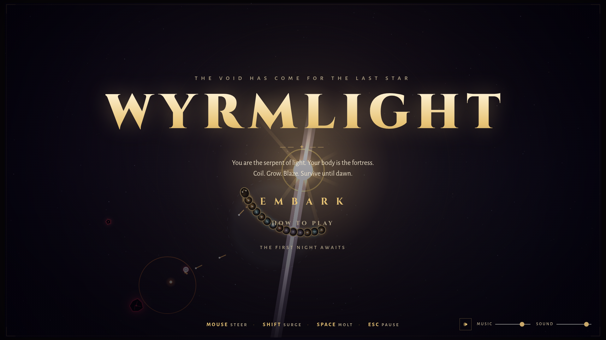
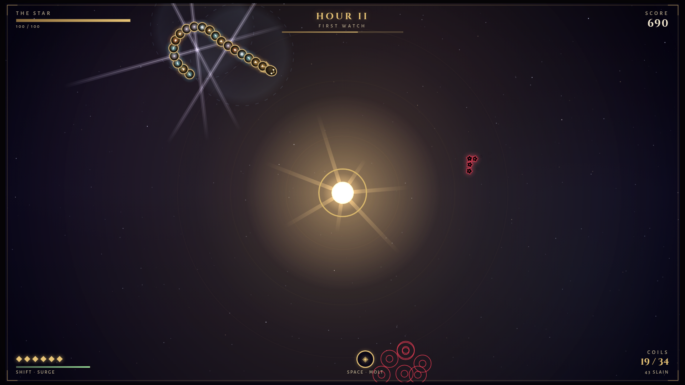

# WYRMLIGHT

**You are the serpent of light. Your body is the fortress. Coil around the last star and survive until dawn.**



WYRMLIGHT is a **snake × tower-defense** arcade game for desktop browsers. The Void besieges
the last Star, and the only wall between them is *you* — an ever-growing celestial serpent
whose every body segment is an auto-firing weapon. Steering is everything: your path is
simultaneously your dodge, your tower placement, your draft, and your aim.

- **Eat starlight, grow cannon.** Kills drop colored motes; each one you eat appends a turret
  segment of that color. Which mote you chase *is* your build order.
- **Shape is a weapon.** Enemies must gnaw through your coils to reach the Star, so your body
  is a living wall. Prism segments fire beams perpendicular to your spine — coil into a wheel
  of rays, or straighten aligned prisms to **merge them into one amplified lance**.
- **Molt under pressure.** Shed your tail as a taunting decoy bomb — converting growth into a
  panic button.
- Survive the **twelve hours of night** (bosses at VI and XII), drafting a boon between hours.
  Win, and you may continue into the **Endless Night** for a high score.

A ~15-minute campaign with a proper difficulty arc, plus endless mode, local best-records, a
generative soundtrack that deepens as the night wears on — everything drawn and synthesized in
code.



## Why this concept

The goal was an original twist on a legible genre. Everyone can read "Snake" and "tower
defense" instantly — but fusing them makes movement *mean* something new: positioning your
body is tower placement, blocking, drafting, and beam-aiming at once. A short research pass
(see [RESEARCH.md](RESEARCH.md)) found one prior snake-TD (an incremental merge game), so this
design deliberately goes the other way: spatial base-defense with body-geometry weapons, a
decoy-bomb molt, and a fixed 12-hour night with a dawn to win. Details and prior-art honesty
in [RESEARCH.md](RESEARCH.md).

## Controls

| Input | Action |
|---|---|
| **Mouse** (or **A/D** / **←→**) | Steer the wyrm |
| **Shift** or **Right-click** (hold) | Surge — speed burst; rams small enemies safely |
| **Space** (or **E**) | Molt — shed 3 tail segments as a decoy bomb |
| **Esc** / **P** | Pause |
| **M** | Mute |
| **1/2/3** or click | Pick a draft card |

Everything is also taught in-game (title strip, HOW TO PLAY screen, first-run toasts).

## Run locally

```bash
npm install
npm run dev      # → http://localhost:5173
```

## Build

```bash
npm run build    # typechecks (tsc --noEmit) then vite build → dist/
npm run preview  # serve the production build
npm run typecheck
```

Requires Node 20.19+ (built with Node 22). Desktop browsers only, tuned for 1080p; scales down
to common laptop sizes. No backend, no external requests — fonts are bundled via npm.

## Tech

Vite + TypeScript (strict). Rendering is hand-rolled **Canvas 2D** with pre-rendered
glow sprites and additive compositing (rationale in RESEARCH.md). All art is procedural; all
audio is Web Audio synthesis (SFX + a generative D-minor score with intensity layers). The
only runtime dependencies are the OFL-licensed fonts (Cinzel, Alegreya Sans / SC) via
Fontsource. See [ASSETS.md](ASSETS.md).

## What was verified

- `npm install`, `npm run build`, `npm run typecheck` — clean.
- Headless-Chromium (Playwright) suite: title renders (non-blank canvas check), help screen,
  title → gameplay, hour banner, draft appears and picks work, Maw boss fight, pause/resume,
  dawn cinematic → victory screen, endless continuation, defeat screen, play-again flow.
  **Zero console/page errors across all runs.**
- Full-campaign autopilot soak at 4× (hours I–XII played end-to-end, no skips): stable, no
  errors; difficulty curve lands as designed (bot won the finale with 33/100 star and 1 heart).
- Production build tested without debug flags at a 1512×982 laptop viewport with real mouse
  steering, keyboard steering, surge, molt, pause, and mute.
- Debug/QA hooks (not needed for normal play): `?debug=1` for F-key state controls and an
  overlay; `?bot=1` for an autopilot demo of the real game.

## Known limitations

- Audio output cannot be heard in headless verification — the synth graph runs error-free,
  but final mix levels were tuned by construction, not by ear.
- Balance was tuned via autopilot soak + curve inspection rather than human playtesting.
- Desktop keyboard+mouse only (by design); no touch support.
- Very old browsers without `ES2022` or Web Audio will not run it.
